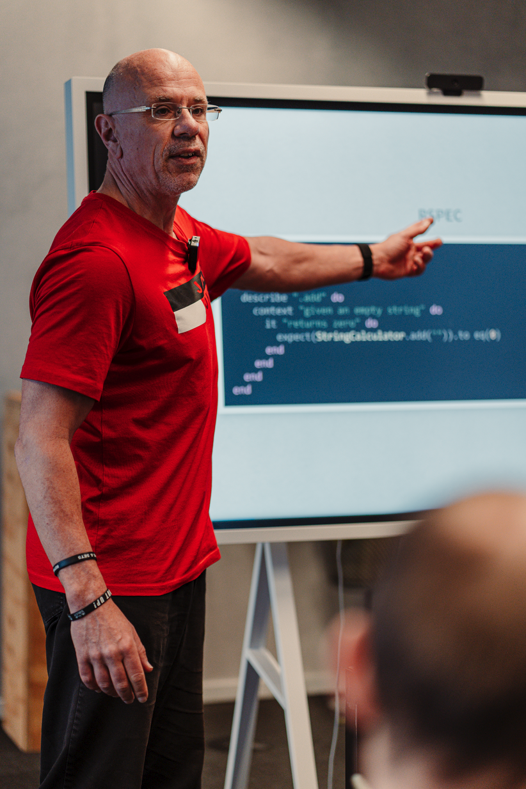
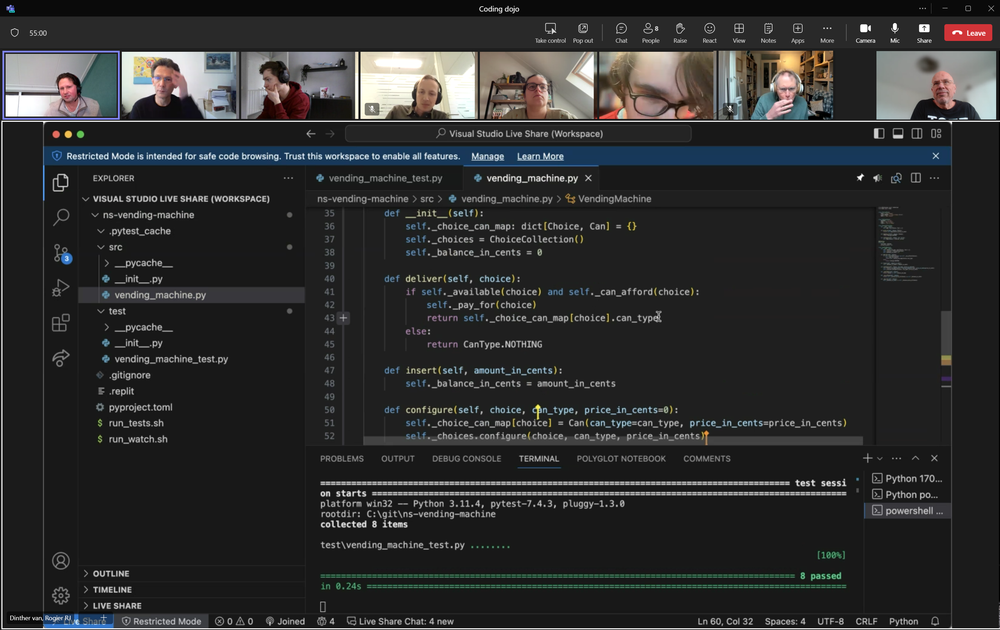
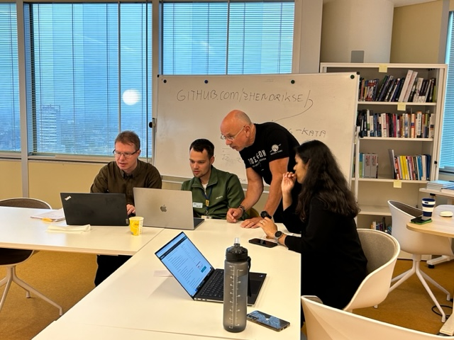

  <figure style="float: left; width: 25%; ">
    
  </figure>
  

   

    🔭 I’m always open to discuss parttime jobs (freelance)! 
   

   

    📝 My resume can be downloaded <a href="https://www.hendrikse.name/cvWeb.docx.pdf">here</a> 
   

   

    👯 I’m currently working on my ✨<a href="https://www.hendrikse.name/science/">science &amp; mathematics website</a>✨ 
   

   

    🌱 I’m relearning the stuff I did as a student theoretical physics 
   

   

    🤔 I’m looking for help creating more scientific 3D visualizations 
   

   

    💬 Ask me about anything! 
   

   

    📫 How to reach me: zegerh_＠_yahoo_•_co_•_uk 
   

   

    ⚡ Fun fact: I love playing the piano 🎹
   

  

# My portfolio

 

## Test-driven development

 

I love teaching people more about [TDD](https://www.hendrikse.name/tdd/).
Strongly recommended: take a look at [my TDD pages](https://www.hendrikse.name/tdd/) 
section that belongs to my TDD repository, which in turn is packed with dozens of 
[coding kata&apos;s](https://www.hendrikse.name/tdd/katas/index.html).

### My [coding dojos](https://www.hendrikse.name/tdd/dojo/index.html)

 

<figure style="float: left; width: 55%; text-align: center">
  &nbsp;&nbsp;&nbsp;
  <figcaption>A typical setting of an online coding dojo.</figcaption>
</figure>
<figure style="float: right; width: 45%; text-align: center">
  
  <figcaption> A typical setting of a coding dojo.</figcaption>
</figure>

## [Interactive 3D simulations & visualizations](https://www.hendrikse.name/science/)

 

I maintain a site containing countless 
[interactive simulations in physics and mathematics](https://www.hendrikse.name/science/).
Some examples are reproduced below.

### [Solar system](https://www.hendrikse.name/science/astrophysics/solar_system.html)

 

🔧 This [solar_system.html](https://github.com/zhendrikse/science/blob/main/astrophysics/code/solar_system.html) uses JavaScript &amp; [Three.js](https://threejs.org/)  
🧠 [Newton-Raphson method](https://en.wikipedia.org/wiki/Newton%27s_method) for realistic (elliptic) orbits 
👉 Inspired on [solar-system](https://github.com/lukekulik/solar-system) by [Luke Kulik](https://github.com/lukekulik/), [threex.planets](https://github.com/jeromeetienne/threex.planets) by [Jemore Etienne](https://github.com/jeromeetienne/), and
[solarsystem](https://github.com/pint-drinker/solarsystem) by [Dana Wensberg](https://github.com/pint-drinker/) 
🔑 Includes tilt, spin and tidal locking of applicable moons e.g. Earth’s moon 
🚀 Features advanced techniques for rendering earth clouds &amp; subtle corona breathing driven by magnetic turbulence



### [Spiral galaxy simulation](https://www.hendrikse.name/science/astrophysics/spiral_galaxy.html)

 

🔧 Written in JavaScript and [Three.js](https://threejs.org/), extended with coloring and fading 
👉 Based on an original idea and [article](https://towardsdatascience.com/create-3-d-galactic-art-with-matplotlib-a7534148a319/) by [Lee Vaughan](https://towardsdatascience.com/author/lee_vaughan/).



### [Black hole ray tracer](https://www.hendrikse.name/science/relativity/black_hole_raytracer.html)

 

🔧 This [black hole ray tracer](https://github.com/zhendrikse/science/blob/main/relativity/code/worker.js)
is a port to JavaScript executed by a [web worker](https://en.wikipedia.org/wiki/Web_worker). 
👉 Refactored and extended with realistic colour coding! 
👉 Based on the [blackhole_raytracer](https://github.com/silvaan/blackhole_raytracer/tree/master) project by Arman T, Casper Y, Lulu W. 
👉 See their accompanying [GitHub pages](https://cyang2020.github.io/BlackHoleRayTracer/) and [video](https://www.youtube.com/watch?v=VTodu1YTURY), where they explain the code.



### [Falling raindrops](https://www.hendrikse.name/science/nature/raindrop_waves.html)

 

🔧 Ported to JavaScript and [Three.js](https://threejs.org/) by [Zeger Hendrikse](https://github.com/zhendrikse/), see [raindrop_waves.html](https://github.com/zhendrikse/science/blob/main/nature/code/raindrop_waves.html) 
👉 Based on [this example](https://beltoforion.de/de/unterhaltungsmathematik/2d-wellengleichung.php) from [Recreational Mathematics with Python](https://github.com/beltoforion/recreational_mathematics_with_python)



### [3D shapes](https://www.hendrikse.name/science/mathematics/geometric_surfaces.html)

 

🔧 This [3D shapes renderer](https://github.com/zhendrikse/science/blob/main/mathematics/code/geometric_surfaces.html) is 100% JavaScript using [Three.js](https://threejs.org/).



### [3D visualization of some molecules](https://www.hendrikse.name/science/molecularphysics/molecules.html)

🔧 Written in pure JavaScript and [three.js](https://threejs.org/).  
👉 Code developed in collaboration with [MrBlankCoding](https://github.com/MrBlankCoding) in [this GitHub repo](https://github.com/MrBlankCoding/Molecule-3d-Visualisation). 
👉 Molecular data taken from [this code](https://glowscript.org/#/user/priisdk/folder/molecules).  
🔑 Hovering your mouse over each of the atoms displays additional information!



