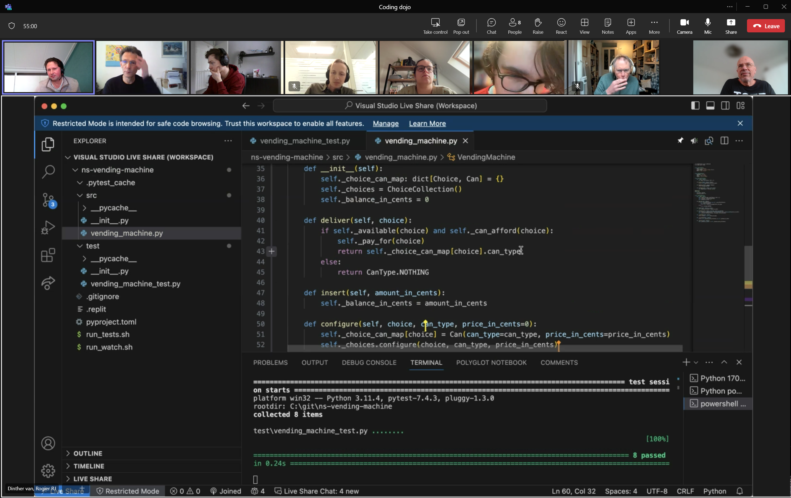
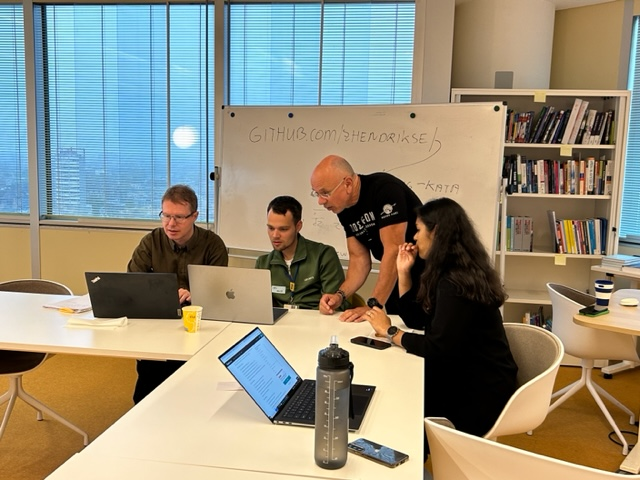

  <figure style="float: left; width: 25%; ">
    
  </figure>
  

   

    🔭 I’m always open to discuss parttime jobs (freelance)! 
   

   

    📝 My resume can be downloaded <a href="https://www.hendrikse.name/cvWeb.docx.pdf">here</a> 
   

   

    👯 I’m currently working on my ✨<a href="https://www.hendrikse.name/science/">science &amp; mathematics website</a>✨ 
   

   

    🌱 I’m relearning the stuff I did as a student theoretical physics 
   

   

    🤔 I’m looking for help creating more scientific 3D visualizations 
   

   

    💬 Ask me about anything! 
   

   

    📫 How to reach me: zegerh_＠_yahoo_•_co_•_uk 
   

   

    ⚡ Fun fact: I love playing the piano 🎹
   

  

# My portfolio

 

## Test-driven development

 

I love teaching people more about [TDD](https://www.hendrikse.name/tdd/).
Strongly recommended: take a look at [my TDD pages](https://www.hendrikse.name/tdd/) 
section that belongs to my TDD repository, which in turn is packed with dozens of 
[coding kata&apos;s](https://www.hendrikse.name/tdd/katas/index.html).

### My [coding dojos](https://www.hendrikse.name/tdd/dojo/index.html)

 

<figure style="float: left; width: 55%; text-align: center">
  &nbsp;&nbsp;&nbsp;
  <figcaption>A typical setting of an online coding dojo.</figcaption>
</figure>
<figure style="float: right; width: 45%; text-align: center">
  
  <figcaption> A typical setting of a coding dojo.</figcaption>
</figure>

## [Interactive simulations & visualizations](https://www.hendrikse.name/science/)

 

&nbsp;&nbsp;
&nbsp;&nbsp;

I maintain a site containing countless 
[interactive simulations in physics and mathematics](https://www.hendrikse.name/science/).
Some examples are reproduced below.

### [Solar system](https://www.hendrikse.name/science/astrophysics/solar_system.html)

 

🔧 This [solar_system.html](https://github.com/zhendrikse/science/blob/main/astrophysics/code/solar_system.html) uses JavaScript &amp; [Three.js](https://threejs.org/)  
🧠 [Newton-Raphson method](https://en.wikipedia.org/wiki/Newton%27s_method) for realistic (elliptic) orbits 
👉 Inspired on [solar-system](https://github.com/lukekulik/solar-system) by [Luke Kulik](https://github.com/lukekulik/), [threex.planets](https://github.com/jeromeetienne/threex.planets) by [Jemore Etienne](https://github.com/jeromeetienne/), and
[solarsystem](https://github.com/pint-drinker/solarsystem) by [Dana Wensberg](https://github.com/pint-drinker/) 
🔑 Includes tilt, spin and tidal locking of applicable moons e.g. Earth’s moon 
🚀 Features advanced techniques for rendering earth clouds &amp; subtle corona breathing driven by magnetic turbulence

  

    <button data-body="sun">🔅 Sun</button>
    <button data-body="mercury">Mercury</button>
    <button data-body="venus">Venus</button>
    <button data-body="earth">🌍 Earth</button>
    <button data-body="mars">Mars</button>
    <button id="farField1">🔭</button>
  

  <canvas class="applicationCanvas" id="planetsCanvas" style="background: black; aspect-ratio: 19 / 12;"></canvas>
  

    <button id="farField2">💫</button>
    <button data-body="jupiter">Jupiter</button>
    <button data-body="saturn">🪐 Saturn</button>
    <button data-body="uranus">Uranus</button>
    <button data-body="neptune">🔱 Neptune</button>
    <button id="zoomIn">🔎</button>
  

### [Black hole GPU ray tracing](https://www.hendrikse.name/science/relativity/black_hole_raytracing.html)

 

⭐ Based on [NASA-BlackHole](https://github.com/cadenmarinozzi/NASA-BlackHole) by [Caden Marinozzi](https://medium.com/@cadenmarinozzi) 
👉 Extended with realistic accretion disk coloring 

<canvas class="applicationCanvas" id="glslBlackHoleCanvas" style="background: black; aspect-ratio: 16/9"></canvas>

### [Falling raindrops](https://www.hendrikse.name/science/nature/raindrop_waves.html)

 

⭐ Inspired by [this example](https://beltoforion.de/de/unterhaltungsmathematik/2d-wellengleichung.php) from [Recreational Mathematics with Python](https://github.com/beltoforion/recreational_mathematics_with_python) 
🔧 Rewritten in JavaScript and [three.js](https://threejs.org/) by [Zeger Hendrikse](https://github.com/zhendrikse/), see 
  [raindrop_waves.js](https://github.com/zhendrikse/science/blob/main/nature/raindrop_waves.js) 

<canvas class="applicationCanvas" id="raindropsCanvas" style="aspect-ratio: 2 / 1;"></canvas>

### [3D shapes](https://www.hendrikse.name/science/mathematics/geometric_surfaces.html)

 

🔧 This [3D shapes renderer](https://github.com/zhendrikse/science/blob/main/mathematics/code/geometric_surfaces.html) is 100% JavaScript using [Three.js](https://threejs.org/).

    <canvas class="applicationCanvas" id="surfaceCanvas"></canvas>

<canvas class="applicationCanvas" id="ringCanvas" style="aspect-ratio: 4 / 1;"></canvas>

### [Equipartition of energy](https://www.hendrikse.name/science/thermodynamics/energy_equipartition.html)

 

🔧 This [energy_equipartition.html](https://github.com/zhendrikse/science/blob/main/thermodynamics/code/energy_equipartition.html) is 100% JavaScript using [Three.js](https://threejs.org/).

<link href="https://unpkg.com/uplot/dist/uPlot.min.css" rel="stylesheet">

<canvas class="applicationCanvas" id="simulationCanvas"></canvas> 

    <button id="pauseButton">&nbsp;Pause&nbsp;</button>
    <button id="bondTypeButton">Bonds as springs</button>

