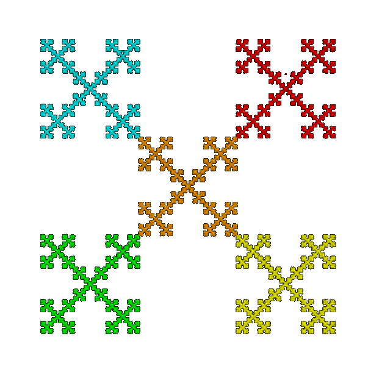

  <figure style="float: left; width: 25%; ">
    
  </figure>
  

   

    🔭 I’m always open to discuss parttime jobs (freelance)! 
   

   

    📝 My resume can be downloaded <a href="https://www.hendrikse.name/cvWeb.docx.pdf">here</a> 
   

   

    👯 I’m currently working on my ✨<a href="https://www.hendrikse.name/science/">science &amp; mathematics website</a>✨ 
   

   

    🌱 I’m relearning the stuff I did as a student theoretical physics 
   

   

    🤔 I’m looking for help creating more scientific 3D visualizations 
   

   

    💬 Ask me about anything! 
   

   

    📫 How to reach me: zegerh_＠_yahoo_•_co_•_uk 
   

   

    ⚡ Fun fact: I love playing the piano 🎹
   

  

# [Fermat's last theorem](https://www.hendrikse.name/fermat-last-theorem/)

 

I created [a website](https://www.hendrikse.name/fermat-last-theorem/) dedicated to the question:

> **Is Fermat's Last Theorem genuinely mathematically interesting, or is it famous just 
> because of the hype and the extraordinary story surrounding it?**

# [Test-driven development](https://www.hendrikse.name/tdd/)

 

I love training people in becoming more fluent with test-driven development.
Please take a look at [my TDD pages](https://www.hendrikse.name/tdd/), the GitHub pages site 
that belongs to my TDD repository, which in turn is packed with dozens of 
[coding kata&apos;s](https://www.hendrikse.name/tdd/katas/index.html) that I use for my [coding dojos](https://www.hendrikse.name/tdd/dojo/index.html).

<figure style="float: left; width: 55%; text-align: center">
  &nbsp;&nbsp;&nbsp;
  <figcaption>A typical setting of an online coding dojo.</figcaption>
</figure>
<figure style="float: right; width: 45%; text-align: center">
  
  <figcaption> A typical setting of a coding dojo.</figcaption>
</figure>

# [Helion: Interactive simulations & visualizations](https://www.hendrikse.name/helion/)

 

I am currently working on a _browser-native_ framework for interactive 
mathematics and physics called [Helion](https://www.hendrikse.name/helion/).
It uses your browser as if it were a virtual laboratory. 
Its API is designed to express scientific ideas as directly as possible by 
offering a scientific domain-specific language embedded in JavaScript

## Mathematics

 

<blockquote>
    Mathematics directs the flow of the universe, lurks behind its shapes and curves,
    holds the reins of everything from tiny atoms to the biggest stars. &mdash;
    <a href="https://en.wikipedia.org/wiki/Edward_Frenkel">Edward Frenkel</a>
</blockquote>

    

        <h3>Fractals</h3>
        

            <figure class="left_image">
                
            </figure>
            <figure class="right_image">
                
            </figure>
        

    

    

        <h3>Strange attractors</h3>
        

            <figure class="left_image">
                
            </figure>
            <figure class="right_image">
                <!-- SPACE RESERVED FOR FUTURE APPLICATION -->            
            </figure>
        

    

## Physics

 

<blockquote>
The feeling of awed wonder that science can give us is one of the highest experiences
of which the human psyche is capable. It is a deep aesthetic passion to rank with the
finest that music and poetry can deliver. &mdash;
<a href="https://en.wikipedia.org/wiki/Richard_Dawkins">Richard Dawkins</a> in
<a href="https://en.wikipedia.org/wiki/Unweaving_the_Rainbow">Unweaving the Rainbow</a>, 1998.
</blockquote>

<!--                                 -->
<!-- Our daily environment and waves -->
<!--                                 -->

  

    <h3>Our daily environment</h3>
    

      <figure class="left_image">
        
      </figure>
      <figure class="right_image">
        
      </figure>
    

    

      <figure class="left_image">
        
      </figure>
      <figure class="right_image">
        
      </figure>
    

  

  

    <h3>Waves &amp; vibrations</h3>
    

      <figure class="left_image">
       
      </figure>
      <figure class="right_image">
        
      </figure>
    

    

      <figure class="left_image">
        
      </figure>
      <figure class="right_image">
        
      </figure>
    

  

