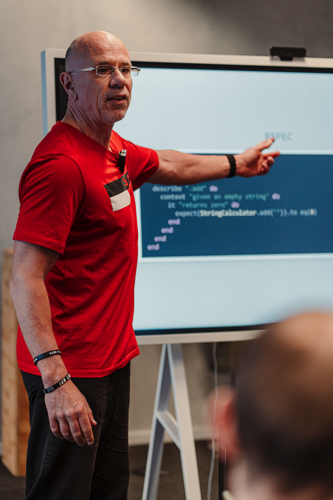
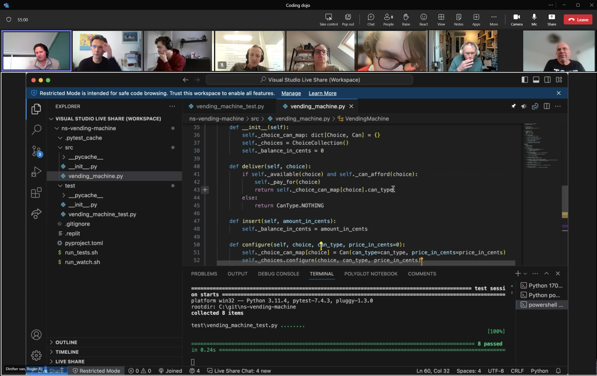
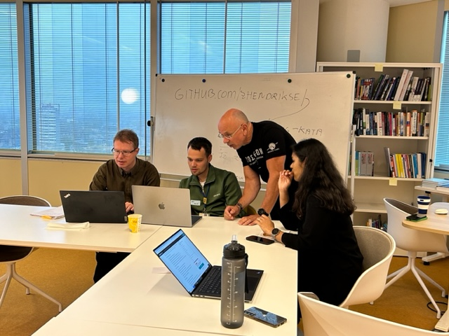

  <figure style="float: left; width: 25%; ">
    
  </figure>
  

   

    🔭 I’m always open to discuss parttime jobs (freelance)! 
   

   

    📝 My resume can be downloaded <a href="https://www.hendrikse.name/cvWeb.docx.pdf">here</a> 
   

   

    👯 I’m currently working on my ✨<a href="https://www.hendrikse.name/science/">science &amp; mathematics website</a>✨ 
   

   

    🌱 I’m relearning the stuff I did as a student theoretical physics 
   

   

    🤔 I’m looking for help creating more scientific 3D visualizations 
   

   

    💬 Ask me about anything! 
   

   

    📫 How to reach me: zegerh_＠_yahoo_•_co_•_uk 
   

   

    ⚡ Fun fact: I love playing the piano 🎹
   

  

# My portfolio

 

## Fermat's last theorem

I created [a site](https://www.hendrikse.name/fermat) dedicated to the question:

> **Is Fermat's Last Theorem genuinely mathematically interesting, or is it famous just 
> because of the hype and the extraordinary story surrounding it?**

## Test-driven development

 

I love teaching people more about [TDD](https://www.hendrikse.name/tdd/).
Strongly recommended: take a look at [my TDD pages](https://www.hendrikse.name/tdd/) 
section that belongs to my TDD repository, which in turn is packed with dozens of 
[coding kata&apos;s](https://www.hendrikse.name/tdd/katas/index.html).

### My [coding dojos](https://www.hendrikse.name/tdd/dojo/index.html)

 

<figure style="float: left; width: 55%; text-align: center">
  &nbsp;&nbsp;&nbsp;
  <figcaption>A typical setting of an online coding dojo.</figcaption>
</figure>
<figure style="float: right; width: 45%; text-align: center">
  
  <figcaption> A typical setting of a coding dojo.</figcaption>
</figure>

## [Helion: Interactive simulations & visualizations](https://www.hendrikse.name/helion/)

 

I am currently working on a _browser-native_ framework for interactive 
mathematics and physics called [Helion](https://www.hendrikse.name/helion/).
Its API is designed to express scientific ideas as
directly as possible by offering a scientific domain-specific language
embedded in JavaScript.

<blockquote>
    Mathematics directs the flow of the universe, lurks behind its shapes and curves,
    holds the reins of everything from tiny atoms to the biggest stars. &mdash;
    <a href="https://en.wikipedia.org/wiki/Edward_Frenkel">Edward Frenkel</a>
</blockquote>

    

        <h3>Fractals &amp; fractal terrain</h3>
        

            <figure class="left_image">
                
            </figure>
            <figure class="right_image">
                
            </figure>
        

    

    

        <h3><a href="mathematics/index.html#3d_fractals">3D fractals</a></h3>
        

            <figure class="left_image">
                
            </figure>
            <figure class="right_image">
                
            </figure>
        

    

