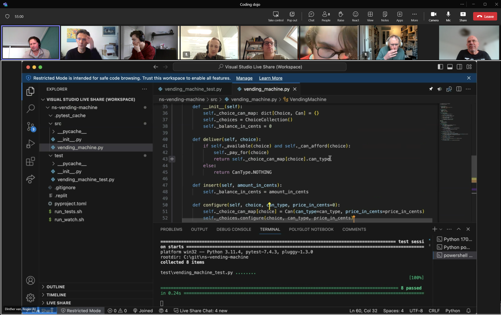

  <figure style="float: left; width: 25%; ">
    
  </figure>
  

   

    🔭 I’m looking for a job (freelance)! 
   

   

    📠My resume can be downloaded <a href="https://www.hendrikse.name/cvWeb.docx.pdf">here</a> 
   

   

    👯 I’m currently working on my ✨<a href="https://www.hendrikse.name/science/">science &amp; mathematics website</a>✨ 
   

   

    🌱 I’m relearning the stuff I did as a student theoretical physics 
   

   

    🤔 I’m looking for help creating more scientific 3D visualizations 
   

   

    💬 Ask me about anything! 
   

   

    📫 How to reach me: zegerh_＠_yahoo_•_co_•_uk 
   

   

    ⚡ Fun fact: I love playing the piano 🎹
   

  

# My portfolio

 

## Test-driven development

 

I love teaching people more about [TDD](https://www.hendrikse.name/tdd/).
Strongly recommended: take a look at [my TDD pages](https://www.hendrikse.name/tdd/) 
section that belongs to my TDD repository, which in turn is packed with dozens of 
[coding kata&apos;s](https://www.hendrikse.name/tdd/katas/index.html).

### My [coding dojos](https://www.hendrikse.name/tdd/dojo/index.html)

 

<figure style="float: left; width: 55%; text-align: center">
  &nbsp;&nbsp;&nbsp;
  <figcaption>A typical setting of an online coding dojo.</figcaption>
</figure>
<figure style="float: right; width: 45%; text-align: center">
  
  <figcaption> A typical setting of a coding dojo.</figcaption>
</figure>

## Interactive 3D simulations & visualizations

 

I maintain a site containing countless 
[interactive simulations in physics and mathematics](https://www.hendrikse.name/science/).
Some examples are reproduced below.

### [3D shapes](https://www.hendrikse.name/science/mathematics/geometric_surfaces.html)

 

🔧 This [3D shapes renderer](https://github.com/zhendrikse/science/blob/main/mathematics/code/geometric_surfaces.html) is 100% Javascript using [Three.js](https://threejs.org/).



